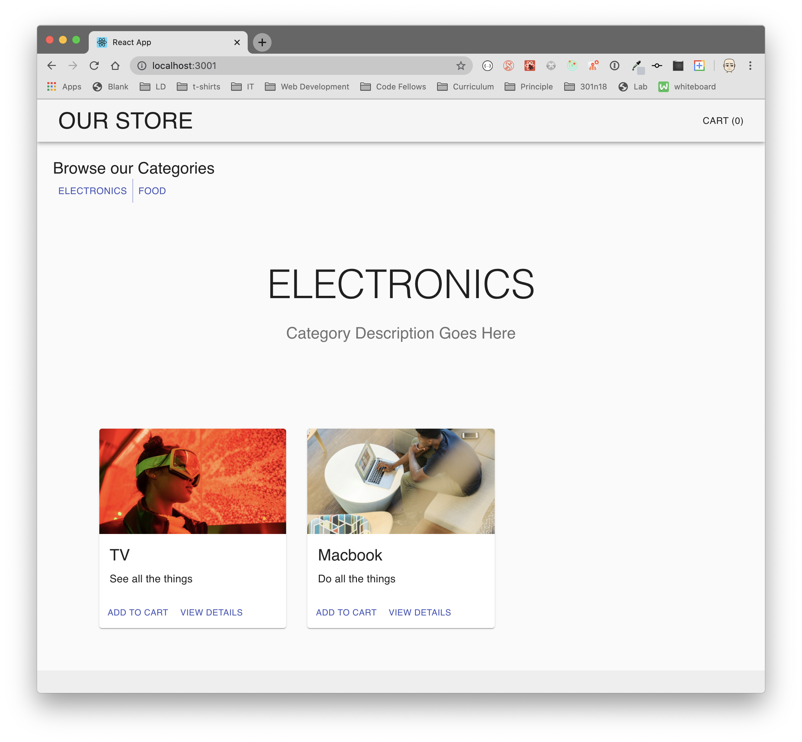

# Virtual Store

Virtual Store using react, redux and materialUI - built in 4 phases. A Web Application for displaying a store with products, detail views, comments, shopping cart

## Author: Fizzo Pannosch

**Version**: 1.1.0

<!-- (increment the patch/fix version number if you make more commits past your first submission) -->

## links and resources

<!-- ## <center> [sandbox deployed site](https://5983i.csb.app/) </center> -->

## <center> [netlify deployed link](https://github.com/fizzo999/storefront) </center>

<!--  -->

<hr>

## <center> UML of starter code - FIZZO </center>

<!--  -->

## Virtual Store

An online shopping portal for a fictional store

## Business Requirements

This application will power an online storefront that will allow users to browse product offerings by category, place items in their shopping cart, and check-out when they are ready to make their purchase.

[Live Example - link to Code Fellows live example website](https://virtual-web-store.netlify.app/)



## Virtual Store

### The core requirements and functionality are as follows:

- Display a list of our product categories
- Display a listing of products for each category, when the category is selected
- From the product listings:
- Click to view a full detail page about the product
- Add the product to your shopping cart
- Shopping cart (simple version) always visible on screen
- Full shopping cart and check out screen available from main navigation

## Technical Requirements

The application will be created with the following overall architecture and methodologies

- React
- ES6 Classes
- Redux Store for Application State
- Deployed API with Mongo storage for storing categories and products
- Superagent or Axios for performing API Requests
- Material UI for layout and styling
- Test Driven Development, using Jest
- Deployment to a cloud provider (Netlify, Amplify, or GitHub Pages)

### Application Structure (proposed)

```linux
├── .gitignore
├── .eslintrc.json
├── ____tests____
│ ├── app.test.js
│ ├── cart.test.js
├── src
│ ├── index.js
│ ├── app.js
│ ├── store
│ │ ├── index.js
│ │ ├── categories.js
│ │ ├── products.js
│ │ ├── cart.js
│ ├── components
│ │ ├── storefront
│ │ │ └── categories.js
│ │ │ └── current-category.js
│ │ │ └── products.js
│ │ │ └── storefront.js
│ │ ├── products
│ │ │ └── details.js
│ │ ├── cart
│ │ │ └── simplecart.js
│ │ │ └── checkout.js
│ │ ├── header
│ │ │ └── header.js
│ │ ├── footer
│ │ │ └── footer.js
└── package.json
```

## Development Process, Milestones

#### Phase 1: Application Setup

- Basic React Application
- Redux State Management
- State managed in memory
- Material UI Components & Styling

#### Phase 2: Shopping Cart

- Add items to a shopping cart
- Update quantities
- Remove items from the cart
- Show the cart in real-time on the UI

#### Phase 3: Live Data

- Connect the application a live API
- Persist changes to products based on cart activity.

#### Phase 4: Checkout & Detail Pages

- Refactor the store to use the latest Redux design pattern (Redux Toolkit)
- Add a cart checkout page
- Add a product details page

<hr/>

## time sheet

- Number and name of feature: phase 1 - setup file structure, UML, re factor class into functional component index.html, index,js, App.js, Form.js, Header.js files - repo on github and deploy to sandbox; setState and setEffect;
- Estimate of time needed to complete: 2 hours
- Start time: 3:00 pm
- Finish time: 7:00 pm
- Actual time needed to complete: 4 hours

<hr/>

## time sheet

- Number and name of feature: phase 2 - finish phase 2 - combined redux - w products and cart to show avatar images of whats in the cart - deploy to sandbox; setState and setEffect;
- Estimate of time needed to complete: 4 hours
- Start time: 3:00 pm
- Finish time: 11:00 pm
- Actual time needed to complete: 7 hours

<hr/>

## time sheet

- Number and name of feature: phase 3 - debug more small UI interface issues, start on thunk - live API data - deploy to sandbox; setState and setEffect;
- Estimate of time needed to complete: 4 hours
- Start time: 2:00 pm
- Finish time: 10:00 pm
- Actual time needed to complete: 7 hours

<hr/>

## time sheet

- Number and name of feature: phase 4 - debug more small UI interface issues, cart detail and product detail; Router link and product counter, product remove and add in detail cart, re deploy;
- Estimate of time needed to complete: 6 hours
- Start time: 6:00 pm
- Finish time: 12:00 pm
- Actual time needed to complete: 7 hours

<hr/>

## Setup

git clone repo from github link:
https://github.com/fizzo999/storefront.git

npm install
(to install dependencies: react, react-dom, react-scripts, redux, react-redux, redux-devtools-extension)

Running the app
npm run start (will run react-scripts start)

<!-- ## Tests

npm run test

- will run the command "react-scripts test --verbose --coverage" -->
<!-- tests performed with jest through react-scripts -->

<!-- "homepage": "https://github.com/fizzo999/storefront#readme" -->

## Architecture

react based jsx frontend that displays a shoppingcart - allows user input to view, comment, select and checkout items to a shopping cart.
